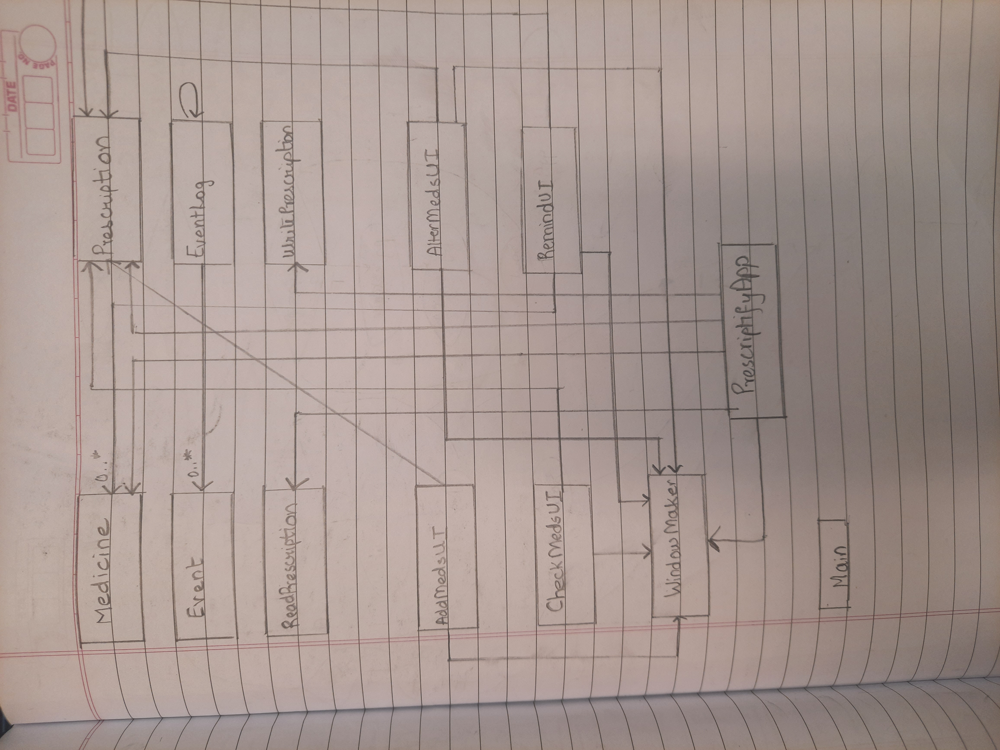

# 
 My Personal Project 

## 
 Prescriptify 
   
 (A personal prescription management and reminder system)

The aim of this project is to design an application that implements a system to store a user's doctor's
prescription and keep track of dosage and time of consumption throughout the day.
This application is also designed to remind the user when and what medicine to consume with convenient pop-up messages. 
 
  The application is mainly designed for, but not limited to:
- **Patients with a large number of medicines to consume throughout the day.**
- **Patients with memory impairment.** 
- **Senior citizens.**

This project particularly appealed to me because I have seen my grandparents at home often forget to take their 
medicines on time. Hence, I wanted to design something convenient and useful that would allow them and 
many others to take care of their health and maintain a routine of taking medicines prescribed by their doctors on time.

## User Stories
- As a user, I want to be able to add medicines to my list of medicines.
- As a user, I want to be able to specify when I am supposed to consume each of the medicines in my list.
- As a user, I want to be able to view the medicines in my list of medicines.
- As a user, I want to be able to remove medicines I have consumed throughout the day.
- As a user, I want to be able to change the consumption time of a certain medicine, as advised by the doctor.
- As a user, I want to be able to view the time of consumption of a given medicine.
- As a user, I want to be able to save the details of my prescription to a file.
- As a user, I want to be able to load the details of my prescription from a file.
- As a user, I want to be able to remind myself when to take a medicine.
- As a user, I want to be able to make changes to my prescription with the changes reflected in my reminder.

# General Instructions

- You can add medicines to the prescription by clicking on the "Add medicine" button on the app window.
- You can alter the time of a medicine by clicking on the "Alter medicine" button.
- You can check medicines to consume in the future by clicking on the "Check medicines" button.
- You can initiate the reminder system by clicking on quit from the menu and the system will display a pop-up window 
and a sound whenever it's time to take a medicine.
- You can locate the visual component (a picture of a stethoscope and prescription pills) right as the application 
opens and the main window appears. 
- Another visual element is a picture of a stopwatch which becomes visible as soon as 
the "Quit" button is accessed from the menu at the top and clicked.
- Navigate between buttons using the tab key and use the buttons using the enter key to perform the required task.
- You can press the enter key in the window on the submit button to submit the medicine information and on the cancel 
button to cancel.
- In the window to check medicines, use the enter key to leave the window.
- You can save the state of the prescription by clicking on the "Save prescription" button in the main menu.
- You can reload the state of the prescription by clicking on the "Load prescription" button in the main menu.
- **Important Note:** If you want to add more medicines or alter them from an existing file, make sure to click on 
"Load prescription" before doing so or the previous prescription would be overwritten. DO NOT click on 
"Save prescription" as you begin. This will also overwrite the existing file.

# Logging an event: example

When a medicine is added to the prescription, an event is added to the event log that describes the addition of the 
medicine with its name and the time it was added for.   For example: when a medicine named "med1" is added to the 
prescription with time 1500hrs, the event description reads:

Furthermore, when a medicine's time is changed, the event is logged as well. For example: if the time of med1 were to
be changed from 1500hrs to 1600hrs, the event description reads:

Note that these messages are printed when the quit button is selected from the menu.

Additionally, note that the medicine added event is added to the event log even when the prescription is loaded because
the load prescription method calls the corresponding add medicine method in the Prescription class.  
So, when load prescription is clicked, and then the quit button is clicked, the events corresponding to adding the 
medicines to the prescription are printed to the console. For example, when two medicines are loaded from the file, we
get:  

# UML diagram and general comments

- Given the UML diagram of classes in this project, a lot of classes use the Prescription class and the Windowmaker
class because it is necessary that each of them is used and passed along the components of the project.
- Additionally, it would have been possible to make Windowmaker an abstract class and have classes in the UI package 
extend it but since they already extended JFrame, it would not have been possible.
- It would also have been possible to make Windowmaker an interface but since some of the ui classes use the same 
implementation of some methods, it would have been redundant to implement the method the same way twice.
- I would have substituted if statements with switch statements to improve readability.
- I would also have converted the method bodies of a few action listeners to a lambda expression.
